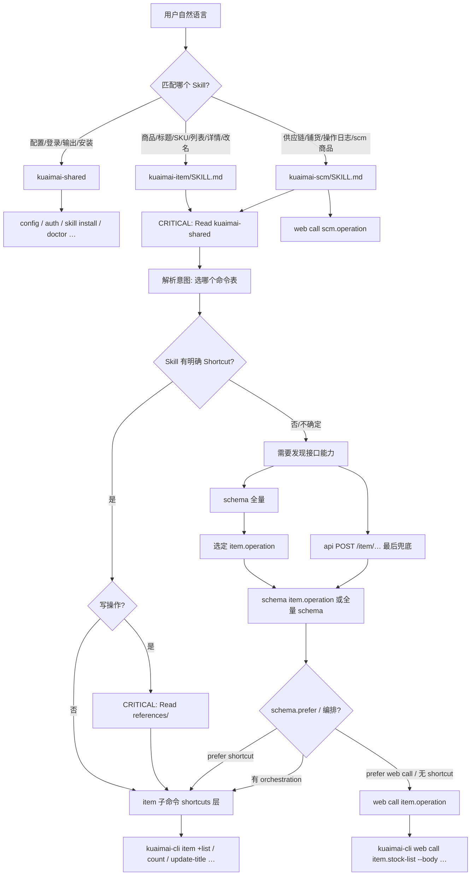
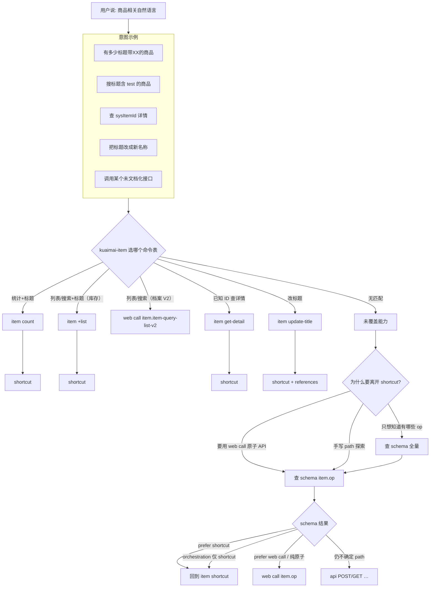
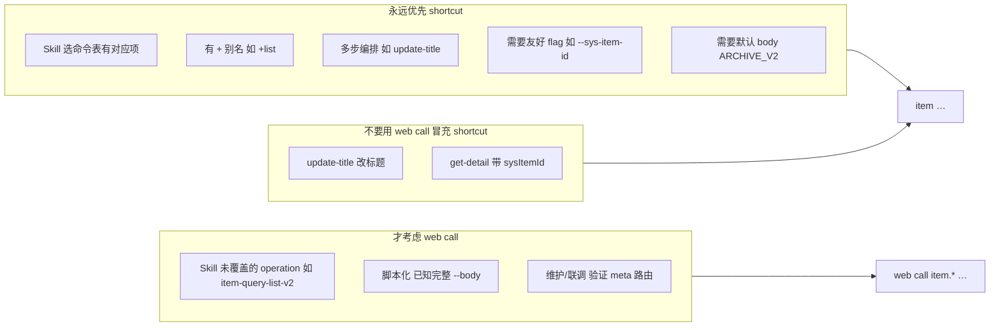
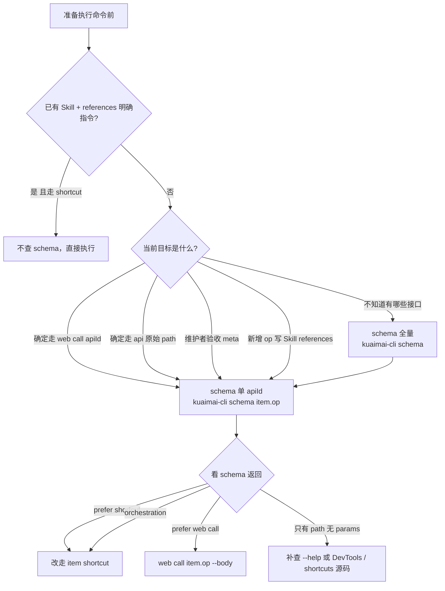
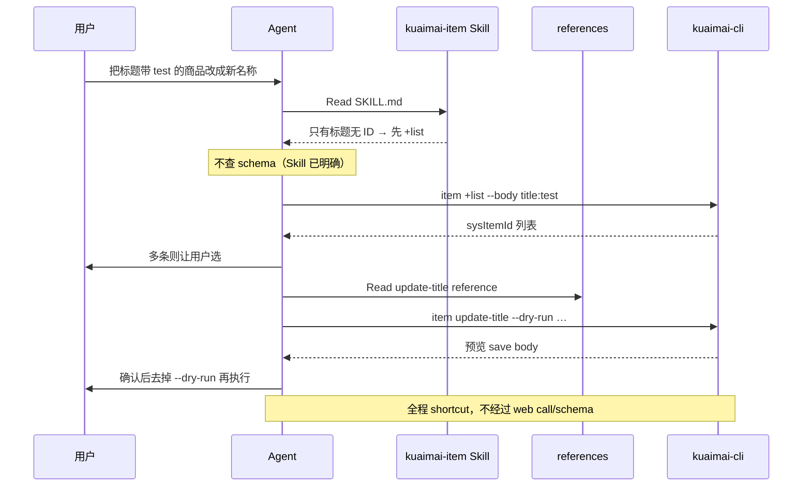

# Agent 命令选型与 schema 流程

> 说明 AI Agent 如何将用户自然语言路由到 **shortcuts**（`item …`）或 **web call**（`web call …`），以及 **何时查询 `schema`**。  
> 配套：[Registry远端同步说明](./Registry远端同步说明.md) · [系统架构与飞书对标说明](./系统架构与飞书对标说明.md) · [AGENTS.md](../AGENTS.md) · [kuaimai-item/SKILL.md](../skills/kuaimai-item/SKILL.md) · [kuaimai-scm/SKILL.md](../skills/kuaimai-scm/SKILL.md)

---

## 1. 三级命令回顾

| 层级 | 命令示例 | 实现 | Agent 默认 |
|------|----------|------|------------|
| **1. shortcuts** | `item +list`、`item update-title` | `shortcuts/item/` | ✅ item 域优先 |
| **2. web call** | `web call item.stock-list`、`web call scm.staff-query` | `registry.json` + `cmd/webcmd` | item 兜底 / **scm 唯一入口** |
| **3. api** | `api POST /item/stock/queryList` | `cmd/api` | 最后手段 |

飞书对标：`calendar +agenda` → `item +list` · `calendar events list` → `web call item.stock-list` · 原生 path → `api POST …`

**Agent 口诀**：

```text
有 Shortcut（item 域）→ 不查 schema，读 Skill / references
scm 域无 shortcuts → 读 kuaimai-scm Skill → web call scm.<operation>
走 web call / api → 先 schema 全量或 schema <apiId>，再执行
不知道有哪些接口 → schema 全量
item 与 scm 路径同为 /item/* 时 → 必读 kuaimai-scm-domain-routing.md 分流
```

---

## 2. 总览：自然语言 → 命令层级



---

## 3. 商品域：Skill 意图 → shortcut / web call



**商品域默认**：「选哪个命令」表能命中的，**一律走 shortcuts**；仅表外或刻意走原子 API 时用 web call / api。

---

## 3.1 供应链域：Skill 意图 → web call

scm 域**无 shortcuts**，Agent 一律 Read `kuaimai-scm/SKILL.md` 后走 `web call scm.<operation>`。

| 用户意图 | meta operation | CLI 命令 |
|----------|----------------|----------|
| 查员工 / 用户列表 | `staff-query` | `web call scm.staff-query` |
| 铺货日志 | `logging-publish-log` | `web call scm.logging-publish-log` |
| 操作日志 | `logging-operator-log` | `web call scm.logging-operator-log` |
| 供应链商品列表 | `item-base-page` | `web call scm.item-base-page` |
| 平台铺货配置 | `dsb-query-distribution-config` | `web call scm.dsb-query-distribution-config` |

**分流 CRITICAL**：路径同为 `/item/*` 时，`web call`（erp1）与 `web call`（scm.superboss.cc）语义不同，必读 [`kuaimai-scm-domain-routing.md`](../skills/kuaimai-scm/references/kuaimai-scm-domain-routing.md)。

**scm 域默认**：Skill 表能命中的直接 `web call`；不确定 operation 名时 `schema --output json`；写操作先 Read 对应 `references/` 并 `--dry-run`。

---

## 4. shortcut vs web call 决策



### 商品域对照表

| 用户意图 | 选（shortcuts） | 不选 |
|----------|-----------------|------|
| 搜/列商品（库存页） | `item +list` | `web call item.stock-list` |
| 搜/列商品（档案 V2） | `web call item.item-query-list-v2` | `item +list`（path 不同） |
| 统计数量（库存页 / 标题） | `item count` | `item +list` 再人工数 |
| 统计数量（商品档案 / 品牌类目等） | `web call item.item-query-count` | `item count`（库存口径）、`item-query-list-v2` 仅取 total |
| 查详情 | `item get-detail --sys-item-id` | `web call item.item-detail --body '{"sysItemId":…}'` |
| 改标题 | `item update-title` | `web call item.item-update-title`（无 get-detail 编排） |
| 复杂改字段 | `item save` + references | `web call item.item-save` 须全量 body |

### shortcuts 与 web call 行为差异（同接口）

| 能力 | `item +list` | `web call item.stock-list` |
|------|--------------|---------------------------|
| 默认 body（ARCHIVE_V2） | ✅ | ❌ 需自传或 schema default |
| `--dry-run` | ❌ 查询接口 | ❌ 查询接口（`write:false` 拒绝） |
| `--page-all` | ✅ | ✅ |
| `--page-limit` / `--page-confirm` | ✅ | ✅ |

详见 [系统架构与飞书对标说明 · §5](./系统架构与飞书对标说明.md#5-dry-run-与-page-all按代码)。

---

## 5. 什么时候查询 schema



### 查 / 不查 对照表

| 时机 | 查不查 | 查什么 |
|------|--------|--------|
| Skill 表 + references 已覆盖 | ❌ 不查 | 直接 `item …` |
| 写操作 save / update-title | ❌ 不查 schema | ✅ Read `references/` |
| 不确定有没有这个 API | ✅ 查 | `schema` 全量 |
| 要用 `web call <apiId>` | ✅ 必须先查 | `schema <apiId>`（如 `schema item.stock-list`） |
| 要用 `api POST /item/…` | ✅ 必须先查 | 同上 |
| 新增/改 meta 后验收 | ✅ 查 | `schema` / 单 op |
| 飞书对标：原生 API 前先看参数 | ✅ 查 | `schema <apiId>` |

### 不必查 schema 的场景

- 按标题 list / count
- 有 `sysItemId` 的 get-detail
- update-title 改标题
- save 且已 Read references
- config / auth / skill 等 shared 域

---

## 6. 端到端示例：按标题改标题



若用户明确要求「用 web call POST save」：

```text
schema（全量）→ web call item.item-save --body '…'（须全量 body）
```

---

## 7. schema 与 registry 发现

**关系**：远端 `registry.json` 是存储层；`schema` 是展示/自省层，读本地同步缓存。

### 推荐流程

```bash
kuaimai-cli capabilities --output json          # 发现 apiId / domain
kuaimai-cli schema <apiId> --output json        # 单接口 requestSchema / responseSchema
kuaimai-cli schema --output json                # 全量 apis 列表
```

单 apiId 示例：

```bash
kuaimai-cli schema api.luotao.test.get --output json
kuaimai-cli schema item.stock-list --output json   # 待远端发布后
```

输出含：`method`、`path`、`contentType`、`write`、`pageable`、`requestSchema`、`shortcut`（若有 curated 映射）等。

**禁止**：在 Skill 或对话中维护手写接口表；参数以 `schema <apiId>` 为准，业务分流以域 Skill `references/` 为准。

---

## 8. 维护者：新增接口时的同步清单

1. 在 `kuaimaierp-cli-auto` 完成 YAPI 拉取、评审，发布至 open-cli `registry.json`（见 [接口 JSON 设计](./接口JSON生成与同步系统设计.md)）  
2. `kuaimai-cli registry sync` → `capabilities` / `schema <apiId>` / `web call` 验收  
3. **item 高频**：可选 `shortcuts/item/` + 更新 `skills/kuaimai-item/references/`（SKILL 只保留意图路由，不写接口表）  
4. **scm**：更新 `skills/kuaimai-scm/references/` 工作流（时间范围、分流等）  
5. `node npm/scripts/sync-skills.js` 后发 npm 包

---

## 9. 相关文档

| 文档 | 说明 |
|------|------|
| [系统架构与飞书对标说明.md](./系统架构与飞书对标说明.md) | §3 三级命令、§5 dry-run、§6 Skill |
| [kuaimai-item/SKILL.md](../skills/kuaimai-item/SKILL.md) | Agent 商品域路由与 references |
| [kuaimai-scm/SKILL.md](../skills/kuaimai-scm/SKILL.md) | Agent 供应链域路由与 references |
| [AGENTS.md](../AGENTS.md) | 仓库根 Agent 约定 |
| [Registry远端同步说明.md](./Registry远端同步说明.md) | 自动同步、capabilities、web call |
| [接口JSON生成与同步系统设计.md](./接口JSON生成与同步系统设计.md) | api-onboard → registry 发布 |
| [meta_data.json 定义规范.md](./kuaimai-cli%20meta_data.json%20定义规范.md) | 历史 v1 字段语义对照 |
| [kuaimai-cli 开发文档.md](./kuaimai-cli%20开发文档.md) | §4.5 元数据注册表、新增 shortcuts 步骤 |
