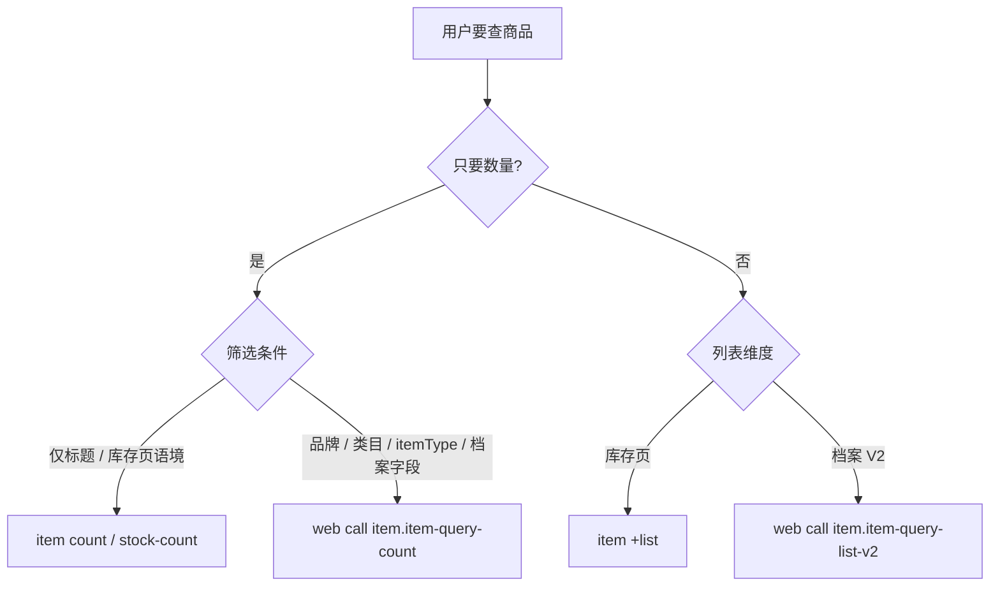

# 商品统计 / 列表：三个接口如何区分

Agent 在用户问「有多少 / 几个 / 总数」或「列出商品」时，**必须先判断业务维度**（库存页 vs 商品档案），再选接口。混用会导致数字口径错误（例如档案品牌筛选用 `item count` 可能偏大）。

## 对照总表

| 维度 | meta operation | path | CLI 命令 | shortcut | 典型场景 |
|------|----------------|------|----------|----------|----------|
| **库存页**统计 | `stock-count` | `/item/stock/queryCount` | `web call item.stock-count` | ✅ `item count` | 标题含 XX **有多少**（库存 ARCHIVE_V2 口径） |
| **商品档案**统计 | `item-query-count` | `/item/queryCount` | `web call item.item-query-count` | ❌ | 品牌 / 类目 / `itemType` 等档案筛选下 **有多少款** |
| **商品档案**列表 | `item-query-list-v2` | `/item/queryListV2` | `web call item.item-query-list-v2` | ❌ | 档案维度 **列出** 商品、取 `sysItemId`；**不要**只为拿 total 而调列表 |

库存页列表（与上表配对，非 count 接口）：

| 维度 | meta operation | path | CLI | shortcut |
|------|----------------|------|-----|----------|
| 库存页列表 | `stock-list` | `/item/stock/queryList` | `web call item.stock-list` | ✅ `item +list` |

## 决策流程



## 各接口说明

### 1. `item count`（`stock-count`）— 库存页统计

- 详见 [`kuaimai-item-count.md`](kuaimai-item-count.md)
- 总数：`data.data.total`
- **禁止**用于「商品档案 + 品牌/类目」的款数统计（与 `item-query-count` 口径不同，同条件可能不一致）

### 2. `item-query-count` — 商品档案统计（推荐）

- 详见 [`kuaimai-item-query-count.md`](kuaimai-item-query-count.md)
- 总数：`data.data.total`（嵌套在 `data.data` 下，以实际响应为准）
- 筛选字段与 `item-query-list-v2` **同源**（如 `brandNames`、`catIds`、`title`）
- `pageNo`、`pageSize` 为 **必填**（meta required）；统计时通常 `pageNo:1`、`pageSize:1` 即可

### 3. `item-query-list-v2` — 商品档案列表

- 详见 [`kuaimai-item-query-list-v2.md`](kuaimai-item-query-list-v2.md)
- 响应含 `total`，但 **「有多少」应优先 `item-query-count`**，避免为计数多拉列表
- 用于需要行数据（标题、`sysItemId`、品牌名展示）时

## 反模式（禁止）

| 错误做法 | 原因 |
|----------|------|
| 档案维度按 `brandNames` 用 `item count` | `stock-count` 是库存页接口，总数可能与档案款数不一致 |
| 只为 total 调 `item-query-list-v2` + `pageSize:1` | 可用专用 count 接口，更轻、语义更清晰 |
| 用 `item +list` 拉全表再 `length` 或按 `brandName` 过滤计数 | 应用 count 类接口 |
| 用 list 的 `total` 与 `item-query-count` 混在不同筛选条件下对比 | 须保证 body 筛选条件完全一致 |

## 示例：品牌「洛可可」有多少个商品（档案款数）

```bash
kuaimai-cli web call item.item-query-count \
  --body '{"brandNames":"洛可可","pageNo":1,"pageSize":1}' \
  --output json --no-color
# → data.data.total
```

**不要**用：

```bash
kuaimai-cli item count --body '{"brandNames":"洛可可"}'   # 库存口径，可能 ≠ 档案款数
```
